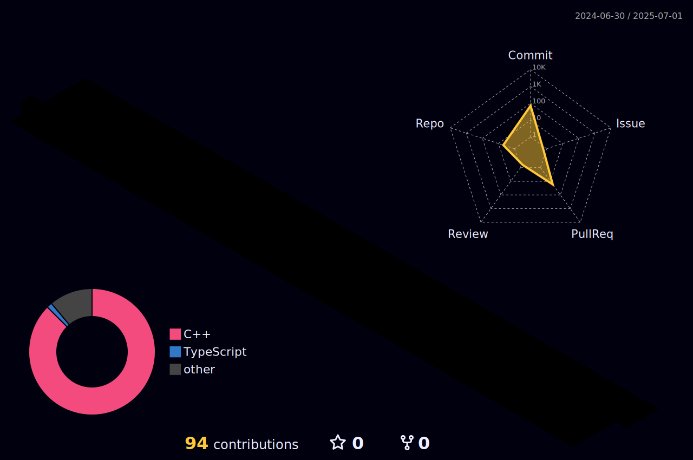

  <h1 style="color:#0070C9;">shunya</h1>
  
ソフトウェアエンジニア

## 📧 連絡先

## 🛠 スキル

## 📊 GitHubコントリビューション

  <picture>
    
  </picture>

## 📈 GitHubステータス

  <picture>
    <source media="(prefers-color-scheme: dark)" srcset="output/metrics.base.svg" width="400" />
    <source media="(prefers-color-scheme: light)" srcset="output/metrics.base.svg" width="400" />
    
  </picture>

## 🏆 実績

  <picture>
    <source media="(prefers-color-scheme: dark)" srcset="output/metrics.plugin.achievements.compact.svg" width="400" />
    <source media="(prefers-color-scheme: light)" srcset="output/metrics.plugin.achievements.compact.svg" width="400" />
    
  </picture>

## 📊 週間開発内訳
<!--START_SECTION:waka-->
<!--END_SECTION:waka-->

---

  

